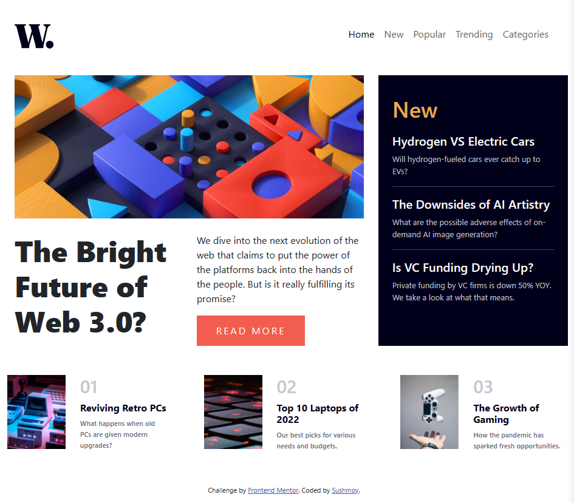
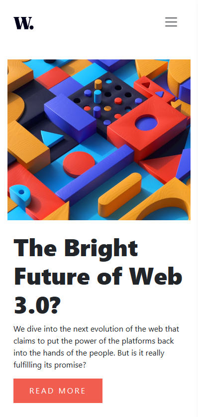

# Frontend Mentor - News homepage solution

This is a solution to the [News homepage challenge on Frontend Mentor](https://www.frontendmentor.io/challenges/news-homepage-H6SWTa1MFl). Frontend Mentor challenges help you improve your coding skills by building realistic projects. 

## Table of contents

- [Overview](#overview)
  - [The challenge](#the-challenge)
  - [Screenshot](#screenshot)
- [My process](#my-process)
  - [Built with](#built-with)
  - [What I learned](#what-i-learned)

## Overview

### The challenge

Users should be able to:

- View the optimal layout for the interface depending on their device's screen size
- See hover and focus states for all interactive elements on the page

### Screenshot

Mobile

### Built with

- Semantic HTML5 markup
- CSS
- Bootstrap

### What I learned

1. I've realized that as projects grow, managing plain CSS can become messy. Therefore, I've decided to opt for using a framework like Bootstrap to maintain code organization and efficiency.

2. Through my studies, I've gained a deeper understanding of how to ensure websites are responsive across various devices. This skill is essential in today's digital landscape where users access the web from a multitude of devices.

3. I've honed my skills in utilizing grid systems more effectively. This has empowered me to create layouts that are not only visually appealing but also structurally sound, enhancing user experience.

4. Bootstrap has been a game-changer for me. Its extensive library of components and built-in JavaScript functions have saved me a significant amount of time during development, allowing me to focus on other aspects of my projects.

5. I'm proud to say that I've successfully implemented the hamburger sidebar for my navbar. This feature adds both functionality and aesthetic appeal to my website, especially on smaller screens.
